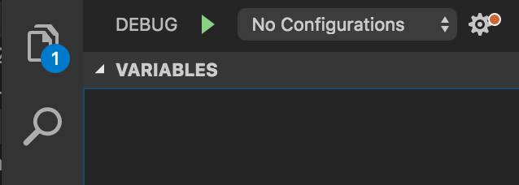

+++
date = "2016-09-29T09:15:51-07:00"
draft = true
title = "Debugging Electron Apps with Visual Studio Code"
tags  = [ "Notes", "Tips", "Programming", "nodejs", "electron", "chrome"]
topics = [ "Tips", "Programming" ]
+++

== Debugging Electron Apps with Visual Studio Code

:author: Ingo Richter
:email: ingo.richter@gmail.com
:doctype: book
:encoding: utf-8
:lang:  en
:toc: left
:numbered:
:sectnums:
:hide-uri-scheme:
:category: notes, howto, blog, tips, tricks, dev, chrome, electron
:date: 09/29/2016
:imagesdir: .

I will show you, how to add a launch configuration to your project to debug your Electron App in http://code.microsoft.com[Visual Studio Code] aka VSCode. I will walk you through the process to create two launch configurations to attach to the different processes of your Electron App. You can find a link to the launch configuration https://gist.github.com/blabla[here].

== Electron Framework Basics
Apps that run on the http://electron.atom.io/[Electron Framework] are great. Easy enough to get something done in a short amount of time. On the other side very powerful because of their deep integration into the host OS.

When it comes to resolving bugs in your Electron App, you can put `console.log` everywhere or you use the debugger. Both will help to resolve the issue, but I still prefer the debugger. Debugging an Electron App can be tricky, since Electron Apps usually consist of at least two different processes

1. The main process 
2. One or more render processes 

To debug any of the processes, you need a different tool for debugging. To debug the main process, you need to use the plain https://nodejs.org/api/debugger.html[node debugger] or https://github.com/node-inspector/node-inspector[node-inspector], which mimics the https://developers.google.com/web/tools/chrome-devtools/[Chrome DevTools].

NOTE: To debug the render process, you can use Chrome DevTools and feel at home right away. You can open DevTools from within your Electron App. Just call `BrowserWindow.webContents.openDevTools()` inside you Electron App to open the DevTools. The best way to do this, is to provide a menu entrie to call that function.

All above mentioned options are working just fine. But there is a better way IMHO.

== Open Electron project in VSCode
Launch VSCode and open your project folder or drag'n'drop your project folder onto the VSCode icon.

== Launch Configurations
To enable Visual Studio Code to connect to your Electron App, you need to create a new https://code.visualstudio.com/docs/editor/debugging#_launch-configurations[launch configuration] to connect to the Node.js process.
VSCode already has builtin support to debug a Nodejs application. 

=== Nodejs Launch Configuration
. Switch to the Debug View in Visual Studio Code either by clicking on the bug icon in the toolbar or by pressing kbd:[Command+Shift+D]
. Click on the gear icon next to the empty dropdown list
. Select Node.js from the Environment list
. A new launch.json file will be created for you

That's all you need to do in Visual Studio Code to connect to your Electron App.

Launch your Electron App from the command line and enable the debugger. From within your project directory, run this

`./node_modules/.bin/electron --debug=5858 .`

The main process is now listening on port **5858** and waiting for connections from a debugger.

In Visual Studio Code select **Attach Process** from the dropdown list in the Debug View. This will attach the debugger to your Electron App. Now you can set breakpoints in your code and debug with the comfort of the debugger in VSCode.
Now you can set breakpoints in your source code and inspect your app.

=== Chrome Devtools Configuration
To connect the render process, you need to copy the snippet below into your existing `launch.json` file. I haven't found a way to have either multiple `launch.json` config file or have the ability to add another debug config to an existing `launch.json`.

[source, json, linenums]
.Debug config to connect to Render Process
----
{
    "name": "Attach to Electron Render Process, with sourcemaps",
    "type": "chrome",
    "request": "attach",
    "port": 9222,
    "sourceMaps": true,
    "webRoot": "${workspaceRoot}"
}
----

TODO:
make sure your project is opened in VSCode to have access to your source code for debugging
Consistency
Pictures
